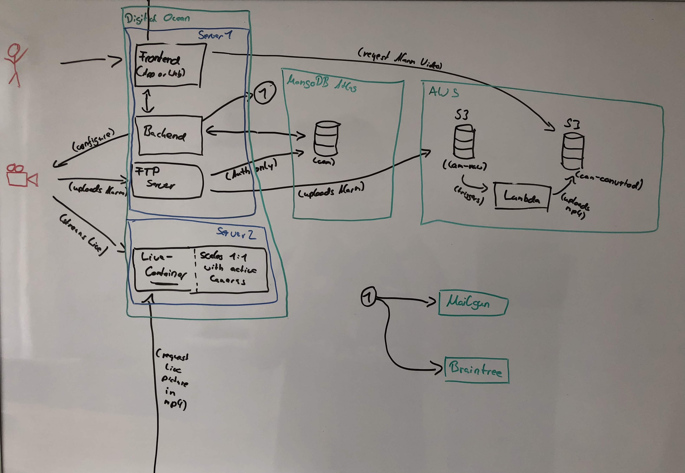

# MKTCloud

All services used to build mktcloud.de

# TOC

1. [Architecture](#Architecture)
2. [Development](#Development)
3. [Deployment](#Deployment)

# Architecture



# Development

Clone this monorepo to your local machine, navigate into it and bootstrap the dependencies:

```bash
yarn bootstrap
```

## Server

First you need a Mongo DB used by the Server. You can do this easily using Docker:

```bash
docker run -p 27017:27017 mongo
```

Then start the server in development mode:

```bash
yarn --cwd packages/server dev
```

You can now visit localhost:4000 to play around with GraphQL Playground.

## Web

To spin up the web client just run the following command:

```bash
yarn --cwd packages/web dev
```

It is reachable from localhost:3000 by default.

To spin up the app client just run the following command:

```bash
yarn --cwd packages/web start
```

## Common

The common package is used by web, app and server. To update the common package you need to test your changes using

```bash
yarn --cwd packages/common test
```

and then build it using the following command:

```bash
yarn --cwd packages/common build
```

depending on the way specified in the package.json from the packages using this module, you may need to publish it too.

## Container Spawner

The container spawner is a little http server which is used by the server. It spawns a container dynamically based on the requests from the server.
It spawns a container using the Image defined in the package converter. You can test the container spawner with the following command:

```bash
yarn --cwd packages/container-spawner dev
```

## Converter

Just a Dockerfile used by Container Spawner.

## s3-backed-ftp

Docker image which spins up a ftpd server. It checks the credentials from the ftp requests against a monog db database. The root of the ftp server is mounted as an fuse drive using yas3fs. The container needs `--previleged` to run.

## serverless-ffmpeg

Converts the mkv files put into a src bucket (for example by `s3-backed-ftp`) into mp4 files into another bucket.
Uses the `serverless` stack

# Deployment

Simplest deployment is possible with:

- two linux servers (DigitalOcean)
  - one with docker and optionally dokku installed
  - the other one needs to run node.js
- an AWS account
- a mongo database
  - for example MongoDB Atlas
- a braintree account
- a mailgun account
- full control over one domain and sub domains (nameserver access)

Check each package for a .env or .env.example file to know which environment variables are supported by the package.

## Server, Client, ftpd

To deploy the server, client and ftpd you can use [Dokku](#Dokku)

## Container Spawner

The container spawner needs to be copied to the second server. The server needs node.js and docker installed. Then you would run:

```bash
# cwd: container-spawner
# build
yarn build
# cwd: container-spawner
# start forever
yarn start:prod
```

You may want to direct an A record from your domain (ie. `cams`) to the server.

## serverless-ffmpeg

First authorize serverless to use your account if not done yet: https://serverless.com/framework/docs/providers/aws/guide/credentials/

After replacing the config.yaml variables you can deploy the stack using serverless, see the yarn script:

```bash
yarn stack-create
```

# Dokku

## Setup Dokku

```bash
# for debian systems, installs Dokku via apt-get
wget https://raw.githubusercontent.com/dokku/dokku/v0.18.3/bootstrap.sh;
sudo DOKKU_TAG=v0.18.3 bash bootstrap.sh
```

[Further information](https://github.com/dokku/dokku/blob/master/docs/getting-started/installation.md#installing-the-latest-stable-version)

### Install letsencrypt plugin

```bash
sudo dokku plugin:install https://github.com/dokku/dokku-letsencrypt.git
dokku config:set --global DOKKU_LETSENCRYPT_EMAIL=your@email.tld
```

[Further information](https://github.com/dokku/dokku-letsencrypt#installation)

## Setup new application in Dokku

In the following the application name will always be `APP_NAME`. The exposed port by the container will be `APP_PORT`. Please change this when executing this guide. The IP or Domain of your dokku server will always be `DOKKU_SERVER`, please change this too.

First you need to create the application:

```bash
# on the Dokku host
dokku apps:create APP_NAME
```

When you have access to the git repository you can deploy the following way, if you want to deploy a docker image you have to scroll a little bit further:

### Deploy a git repo to Dokku

```bash
# from your local machine
# the remote username *must* be dokku or pushes will fail
cd APP_NAME
git remote add dokku dokku@DOKKU_SERVER:APP_NAME
git push dokku master
```

[Further information](http://dokku.viewdocs.io/dokku/deployment/application-deployment/#deploying-to-dokku)

### Deploy a docker image

```bash
# on the Dokku host
# pull the image you want to deploy
docker pull demo-repo/some-image
# retag the image to match the created app
docker tag demo-repo/some-image:latest dokku/APP_NAME:v1
# deploy tag
dokku tags:deploy APP_NAME v1
```

[Further information](http://dokku.viewdocs.io/dokku/deployment/methods/images/#deploying-from-a-docker-registry)

### Setup SSL

```bash
# Forword port 80 to application port
dokku proxy:ports-add APP_NAME http:80:APP_PORT
# Let letsencrypt do its magic
dokku letsencrypt APP_NAME
# Forward 433 too
dokku proxy:ports-add APP_NAME https:443:APP_PORT
# to remove a potential leftover proxy that was automatically configured on first deploy
dokku proxy:ports-add APP_NAME http:APP_PORT:APP_PORT
```

[Further information](https://github.com/dokku/dokku-letsencrypt#dockerfile-deploys)

### Special configuration for ftpd

For example the ftpd app needs port 21 and 30000-30100 to operate the ftp server. Also you need to diable the nginx proxy, because we dont use the http(s) protocol but ftp. Dokku doesn't support port ranges, so we use docker-options directly instead.

```bash
# diable VHOST
dokku proxy:disable APP_NAME
# set docker options directly
dokku docker-options:add APP_NAME deploy,run "-privileged -p 0.0.0.0:21:21/tcp -p 0.0.0.0:21:21/udp -p 0.0.0.0:30000-30100:30000-30100/tcp -p 0.0.0.0:30000-30100:30000-30100/udp"
```
